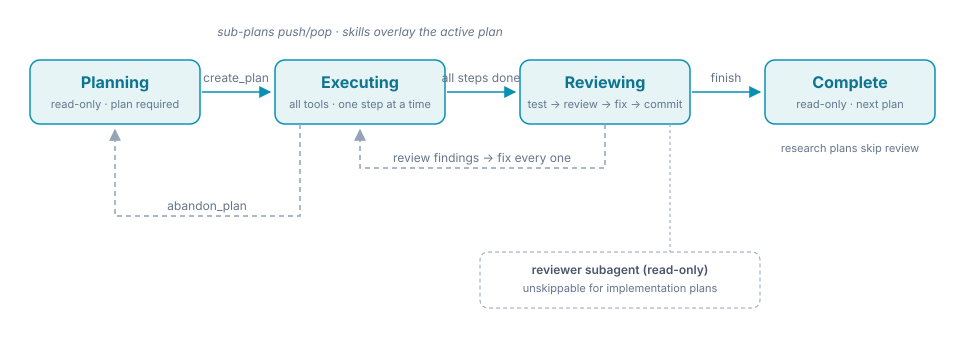

# Mnemo

> **An agentic coding harness that remembers.**

Named after Mnemosyne, the Greek titaness of memory — because the point is that your agent gets *better* at your codebase the longer it works on it, instead of starting from zero every session.


Mnemo is a **Rust + Tauri desktop app** that turns an LLM into a disciplined coding agent. It runs the model inside an **enforced plan-first state machine**, keeps a **four-tier persistent memory** across sessions, navigates the codebase through a **tree-sitter knowledge graph**, and puts **approval gates on every mutation**.

It is not a chat window with file access — it is a harness that makes a good model reliable and a small model viable.

---

## Why Mnemo exists

If you've iterated with coding agents, you know the pattern. The pain points Mnemo was built to eliminate:

- **Plans evaporate.** Context resets, sessions restart, and the agent re-derives what it already knew — or worse, re-decides it differently.
- **The tools array bloats.** Every capability is advertised all the time, so the model calls the wrong one, at the wrong moment, or not at all.
- **Big models become a crutch.** You pay flagship prices for the privilege of the agent losing the plot halfway through.
- **Memory doesn't survive.** Everything your agent learned about your project last week is gone today.
- **The harness trusts the model.** Mutations go out unchecked; one confident wrong turn costs an hour of cleanup.

**Not a model problem — an allocation problem.** The same model is brilliant when the plan is right and hopeless when it's reconstructing intent from a stale context. So Mnemo allocates: a sharp model plans, a cheap model executes, a reviewer audits, and every handoff is a file on disk.

The spec-loop, enforced end to end: **spec → plan → code → test → review → commit**, with every artifact persisted — not remembered.

---

## Highlights

| | |
|---|---|
| **Enforced workflow** | Planning → Executing → Reviewing → Complete — a state machine decides which tools exist at each moment; the agent cannot skip ahead. |
| **Four-tier memory** | Working → episodic → semantic → procedural, persisted in SQLite with recall ranked by strength; consolidation compresses sessions into durable knowledge. |
| **Knowledge graph** | Tree-sitter parses 12 languages (Rust, TS/TSX, JS, Python, Go, Java, C/C++, C#, Ruby, PHP, HTML) into a per-project SQLite graph: callers, callees, imports, blast radius, shortest paths. |
| **Safety first** | Approval gates on mutations, git merge/push always gated, read-only reviewer agents that cannot self-approve, `.coding/` state sandboxed from the file tools. |
| **Multi-model routing** | Per-workflow-state model slots, per-model context/reasoning budgets, effort control, stop-boundary handling for exotic tokenizers. |
| **Optional Laya classifier** | An opt-in "System 1" text classifier: a managed `laya-serve` sidecar — downloaded in Settings, auto-started/stopped by the app on 127.0.0.1 — answers typed questions (choice / score / yes-no) with calibrated probabilities for cheap decisions. Off by default — while it is off, nothing is called. Optional memory auto-typing corrects a record's typed prefix when the classifier is confident (needs a fine-tuned checkpoint; seed examples cover SPEC/DECISION/BUG/HOW), and optional failure triage classifies every tool/provider failure (transient / permanent / needs-user / flaky-test) to steer retries — read-only calls auto-retry without a model roundtrip — while every classified failure is logged with its true outcome so a startup fine-tune can retrain the checkpoint from real dispositions (managed mode) — and an optional kNN overlay (`failure_triage_knn`) learns from that same log immediately, embedding each failure with the local memory embedder and majority-voting the most similar logged failures (vote share = confidence; needs no `laya-serve`). |
| **Parallel agents** | Spawn sub-agents for research or review; a Run-All backlog dispatches queued plans into parallel worktrees. |
| **Token-optimizer levers** | Six opt-in context-economy levers (`[general.optimizer]`, all off by default): delta/skeleton re-reads, command-output compression with credential redaction, archive/expand progressive disclosure (`expand_result`), compaction survival (checkpoint + preserved decisions + digest), an S–F context-quality score in the ctx popup, and cache-safe lean-output nudges — each writing a `savings_events` row. Settable in **Settings → Savings**. |
| **Desktop shell** | Tauri 2 + React UI, embedded WebView2 browser tab (Windows), headless REPL console mode, MCP server integration. Extra Windows instances get their own WebView2 profile (the first keeps the persistent one); opening a project twice warns. |

The [feature reference](docs/FEATURES.md) has the exhaustive detail; this is the tour.

---

## The enforced workflow

<p align="center">
  
</p>

1. **Planning** — read tools only. The agent explores the codebase and must call `create_plan` (a goal, context, and ordered steps) before it can touch anything.
2. **Executing** — all tools available, one step at a time; sub-plans stack and pop back exactly where they left off.
3. **Reviewing** — implementation plans get a read-only reviewer agent that audits the diff, carrying a harness-rendered contract (verdict format, constitution checks, `.coding/**` bookkeeping rule); from round 2 the app scopes it to `git diff <base>` — only what changed since the round before. Every finding must be fixed or justified.
4. **Complete** — the change lands on a working branch with the review report in the repo.

That's the whole trick: **a tool-schema guardrail, not a suggestion**. The agent physically cannot write code without a plan on disk — which is what makes a smaller executor model viable.

---

## How the repository works

```
src/                  the `mnemo` library — the harness core (no Tauri)
  agent/                turn loop, approval gates, context construction, plan dispatch
  workflow/             the plan-first state machine
  memory/               four-tier store: consolidation, embedder, knowledge files, strength decay
  codegraph/            tree-sitter extraction → SQLite graph: query, walk, watcher
  tool/                 tool implementations: files, shell, git, memory, browser, agent
  safety_rules/         the constitution the agent cannot ignore
  provider/             model endpoints: OpenAI/Anthropic-compatible + local
  model_resolver.rs     per-state model routing + effort resolution
  mcp/                  Model Context Protocol client (stdio + remote, OAuth)
  backlog.rs            the Run-All queue
src-tauri/            the `mnemo-app` desktop shell (Tauri 2)
  src/                  startup, watchdog, console (headless REPL mode), IPC
  tests/                source-contract tests guarding the vendored patches
frontend/             React 18 + TypeScript + Vite + Tailwind UI
tests/integration/    cross-boundary integration tests
scripts/              the npm launcher (start.mjs) + maintenance scripts
vendor/               patched tao + wry — each with a PATCHES.md, wired via [patch.crates-io]
assets/               diagrams (workflow.svg)
agent.md              the project constitution — loaded before every agent turn
PLAN.md               the technical-decisions log
.coding/              the agent's own state, versioned with the repo (see below)
```

**The lib/app split.** `mnemo` is a plain Rust library — the state machine, memory, graph, and tools all work headless. `mnemo-app` is the Tauri 2 shell that embeds it, always selecting the heavier optional features (embedded browser, embeddings).

**`.coding/` is the memory the repo carries.** Plans, review reports, knowledge files, and the backlog travel in git and merge across machines; the SQLite caches (`memory.db`, `codegraph.db`) are rebuildable and gitignored. A fresh clone of Mnemo's own repo arrives with its development history already loaded.

**Vendored patches.** `vendor/` carries small, documented patches to `tao` (Windows IME self-deadlock fix) and `wry` (SSO + hard-reload for the embedded browser), each guarded by source-contract tests in `src-tauri/tests/`.

---

## Quickstart — clone & build

**Prerequisites — Windows 10/11:**

- [Rust](https://rustup.rs) (stable toolchain)
- [Node.js LTS](https://nodejs.org)
- Visual Studio Build Tools with the **Desktop development with C++** workload
- WebView2 Runtime (preinstalled on Windows 10/11)

**Prerequisites — macOS 11+:**

- Xcode command-line tools: `xcode-select --install`
- [Rust](https://rustup.rs) (stable toolchain)
- [Node.js LTS](https://nodejs.org)

```bash
git clone https://github.com/chessIthaca/Mnemo.git
cd Mnemo
npm install
npm start
```

`npm start` compiles the Rust core, bundles nothing, and launches the desktop app. Launcher modes:

| Command | What it does |
|---|---|
| `npm start` | build + launch the release binary |
| `npm start dev` | Vite dev server + native window, hot-reloading UI |
| `npm start build` | compile the binary only |
| `npm start bundle` | produce platform installers (`.msi`/`.nsis` on Windows, `.app`/`.dmg` on macOS) under `target/release/bundle` |

Prefer driving the toolchain yourself? The Tauri CLI is hoisted to the root `node_modules`, so run it from `src-tauri/`:

```bash
cd src-tauri
npx tauri dev      # dev build + app window
npx tauri build    # release build (add --no-bundle to keep it to the binary)
```

---

## Development & tests

```bash
cargo test                 # the mnemo library crate
cargo test -p mnemo-app    # the desktop shell app crate
cd frontend
npx tsc --noEmit           # type check (vitest hides type defects)
npm test                   # frontend unit tests
```

Two heavyweight optional cargo features exist on the library — `browser` (headless-browser tooling) and `embeddings` (local ONNX memory search) — plus a dev-only `test-support` feature for cross-crate test factories. The two heavyweight ones are off by default for light builds; the app always selects both.

## A few configs you should check right away

In the config dialog download a semantic model that runs locally on your machine for the memory to be most effective and reindex after that.

If you want in browser debugging you have to enable it in the advanced section of the config dialog.

If you want fast, calibrated "System 1" decisions (opt-in, off by default), open Settings → Classifier and pick Managed: Mnemo downloads a self-contained Laya runtime (uv + virtualenv + `laya[serve]` + checkpoint — roughly 0.8–1 GB plus the checkpoint) with a live progress bar, then automatically starts, monitors, and stops the local `laya-serve` sidecar on 127.0.0.1. No command line, no Python prerequisites. Advanced: run `laya-serve` yourself and point the section at its endpoint URL instead.

### Context economy — the `[general.optimizer]` levers

Six independent context-economy levers, all **off by default**; with a flag
off, the code path is byte-identical to pre-lever behaviour. Turn them on in
**Settings → Savings** (each toggle takes effect on the next tool call — no
restart; the Dashboard view meters what they save, per project), or add the
`[general.optimizer]` section to `config.toml` by hand:

```toml
[general.optimizer]
delta_reads = true           # re-reads serve a skeleton or a diff, not whole files
compress_output = true       # compress known command families + redact credentials
archive = true               # archive large tool results; expand_result retrieves them
compaction_survival = true   # survive summarization: checkpoint + preserved decisions
quality_score = true         # S–F context grade in the ctx hover popup
lean_output_nudge = true     # keep the model's own output lean as the window fills

# knobs (defaults shown)
archive_min_chars = 20000    # only results at least this large are archived
compress_min_chars = 2000    # only outputs at least this long are compressed
lean_output_fill_pct = 25    # fill % at which the lean-output nudge starts
nudge_cooldown_requests = 10 # requests between two nudges
compress_extra_commands = [] # extra command prefixes to compress
```

Every lever writes a row to the `savings_events` ledger, so its cost/benefit is
auditable. The always-advertised `expand_result` tool retrieves any archived
result by id or keyword. The Dashboard view (right panel, immediately before
Memory) reads the ledger back per project: metered tokens saved, per-kind and
per-day breakdowns, the recent events, and a prompt-cache section whose dollar
figures are labelled ESTIMATED. It re-reads the ledger every 2 s while the tab
is open (and on window focus), so new savings appear without reopening it.

Have fun and let me know where we can improve things.
Pull requests gratefully considered.

---

## Where the detail lives

- [docs/FEATURES.md](docs/FEATURES.md) — the exhaustive feature reference (memory tiers, graph, tools, workflow mechanics)
- [docs/CONFIGURATION.md](docs/CONFIGURATION.md) — providers, models, effort routing, MCP servers, per-project state
- [PLAN.md](PLAN.md) — technical decisions and provider strategy
- [agent.md](agent.md) — the project constitution the agent loads every turn
- [vendor/wry/PATCHES.md](vendor/wry/PATCHES.md) + [vendor/tao/PATCHES.md](vendor/tao/PATCHES.md) — what is patched upstream and why
- `.coding/` — the agent's own working state (plans, reviews, knowledge, backlog)

---


## License

MIT — see [LICENSE](LICENSE). Copyright © 2026 Carsten Hess.
